# FlyThings 开发文档（简化版）

## 目录

1. [关于我们](#关于我们)
2. [安装](#安装)
   - 安装环境
   - 初次使用
   - 界面概览
3. [开发流程](#开发流程)
   - 新建项目
   - 项目结构
   - 编译项目
   - 新建UI文件
   - 运行项目
   - UI文件与生成代码
   - 开发工具常用技巧
   - 导入项目
4. [Manifest](#manifest)
   - Manifest 介绍
   - 切换平台
   - 添加依赖包
   - 添加本地库
   - 制作静态库或动态库
5. [界面交互](#界面交互)
   - 启动界面
   - 打开/关闭界面
   - 界面活动周期
6. [定时器](#定时器)
7. [串口通讯](#串口通讯)
   - Linux串口编程
   - 简介 / 通讯框架讲解
   - 串口配置 / 多串口配置
8. [网络控制](#网络控制)
   - Wi-Fi设置 / 热点设置
9. [系统操作](#系统操作)
    - 数据存储 / 系统时间 / TF卡/U盘 / 插拔TF卡监听
    - GPIO操作 / SPI操作 / 重启系统 / 内存和CPU信息
10. [升级与调试](#升级与调试)
    - ADB调试 / 查看日志 / TF卡启动
    - 制作升级镜像 / 自动升级 / 远程升级 / 批量升级
11. [附录](#附录)
    - 常见问题 / 安装ADB驱动

---

# 关于我们

## 目标
让开发更加简单，高效；让普通用户拥有更便易的客制化开发方案。

## 价值
- 专业：用专业的技术铸造专业的产品
- 创新：不断的开拓创新为客户提供源源不断的价值
- 责任：用技术改变生活

---

# 安装

## 安装环境

### FlyThings IDE

<a href="https://download.s21i.co99.net/14731609/0/0/ABUIABBPGAAglMLczgYo0Mjk3AU.zip?f=flythings-ide-win32-win32-x86-zkswe-setup.zip&v=1775706403"><strong>FlyThings IDE</strong></a>（20260403）

### Linux 版本工具链

适用平台 `SSD`、`Z20`、`Z21`、`Z261`：

* [ssd.tar.gz](https://download.flythings.cn/toolchain/ssd.tar.gz)

---

## 初次使用

安装完成后，在桌面找到  快捷方式，双击运行。  
也可以在安装目录的 `bin` 文件夹下找到  直接运行。

### 选择工作空间

启动后会弹出工作空间选择界面。**工作空间**用于存储相关设置及历史记录，可同时管理多个项目。

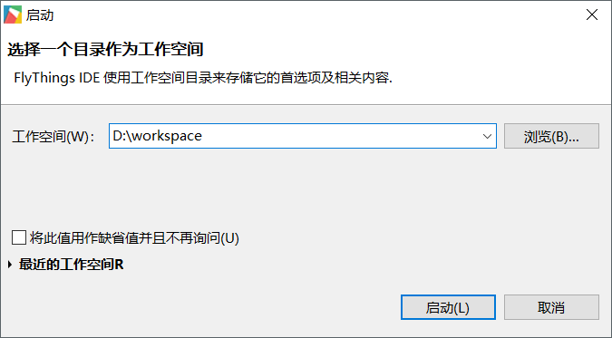

### 欢迎界面

第一次打开或选择新工作空间后，会显示欢迎界面，提供两个快捷功能：

- **新建项目**：逐步引导新建 FlyThings 项目
- **导入项目**：将现有项目导入当前工作空间继续开发

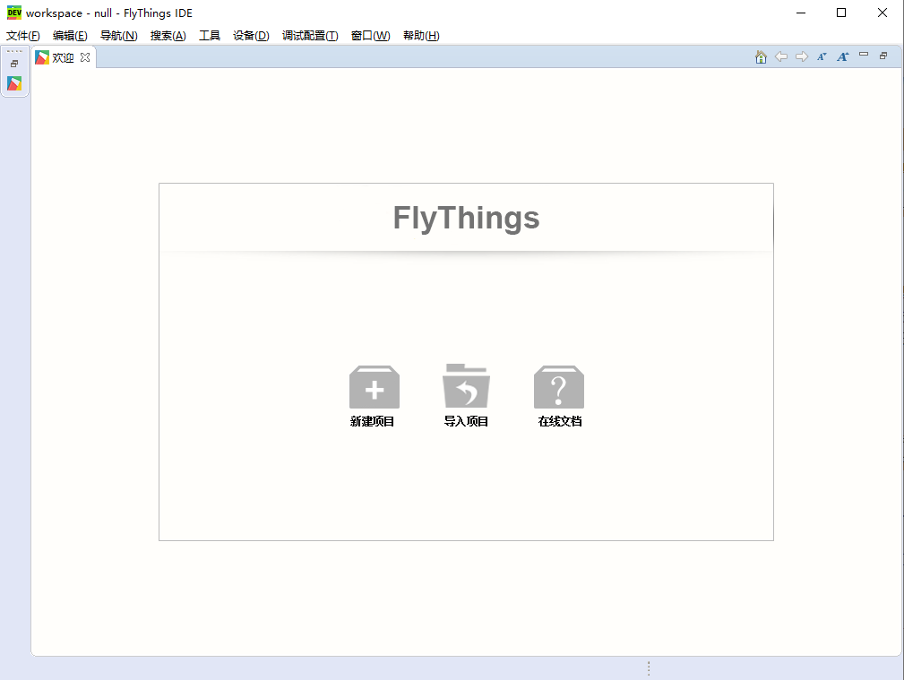

---

## 界面概览

### 项目资源管理器

将项目文件夹内的资源文件、代码文件等以树形图的形式显示。可自由展开/收起，双击文件可直接打开编辑。

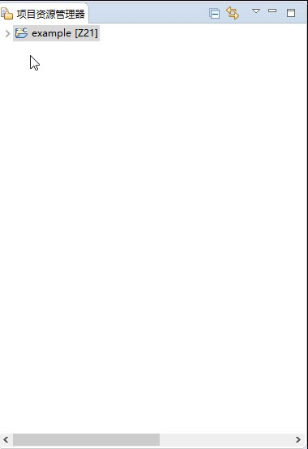

### 控制台

编译代码时，这个位置将输出编译日志。如果编译失败，双击**错误提示内容**，可直接跳转到对应代码。

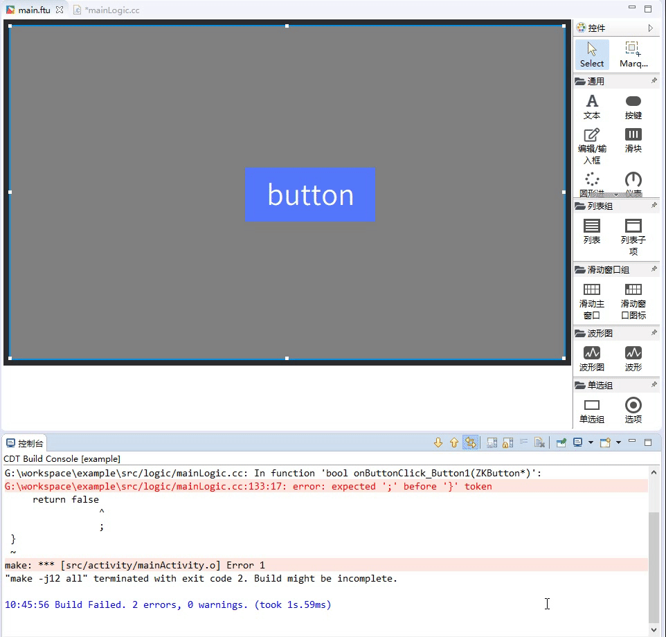

---

# 开发流程

## 新建项目

1. 在编辑器顶部的菜单栏中，依次选择 **文件 -> 新建 -> FlyThings项目**。

   

2. 上一步选择完成后，将弹出 **FlyThings创建向导** 提示框。

   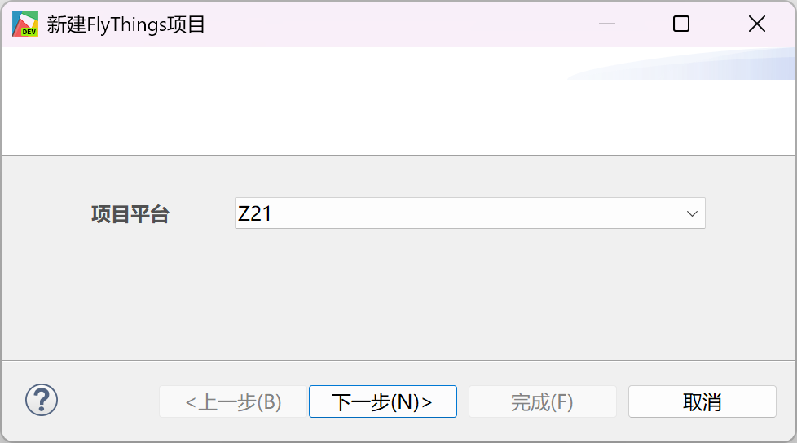

   按要求填写新建项目相关的参数。

   * **平台类型**：根据购买的串口屏选择相应的平台。

3. 点击下一步之后，我们将看到更多的参数定义。

   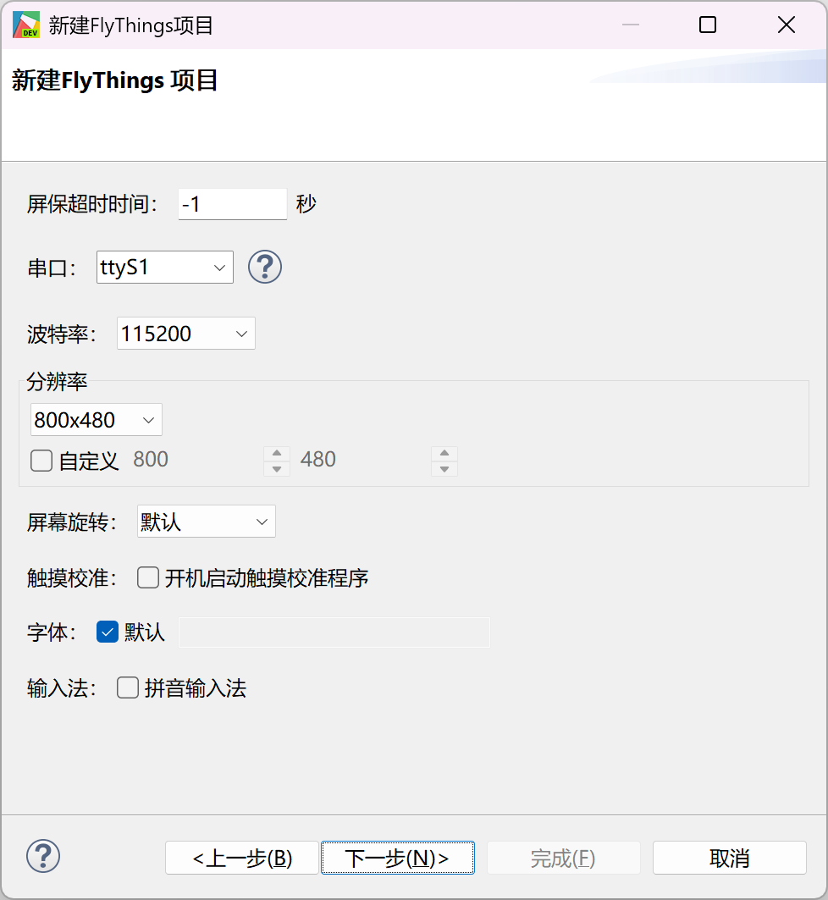

   * **屏保超时时间**：如果在指定时间内没有任何触摸操作，系统将自动进入屏保。时间为 **-1** 秒表示禁止屏保。
   * **串口**：指定通讯串口，一般不需要修改。
   * **波特率**：指定通讯串口的波特率。
   * **分辨率**：以像素为单位，指定屏幕的宽高。
   * **屏幕旋转**：针对坐标轴方向不同的屏幕，可勾选此项将显示内容旋转90°。
   * **字体**：支持自定义字体。
   * **输入法**：如果需要输入中文，必须勾选，配合编辑输入框控件使用。

   以上属性后续均可再次修改。

4. 继续点击下一步，设置项目名称和保存路径。

   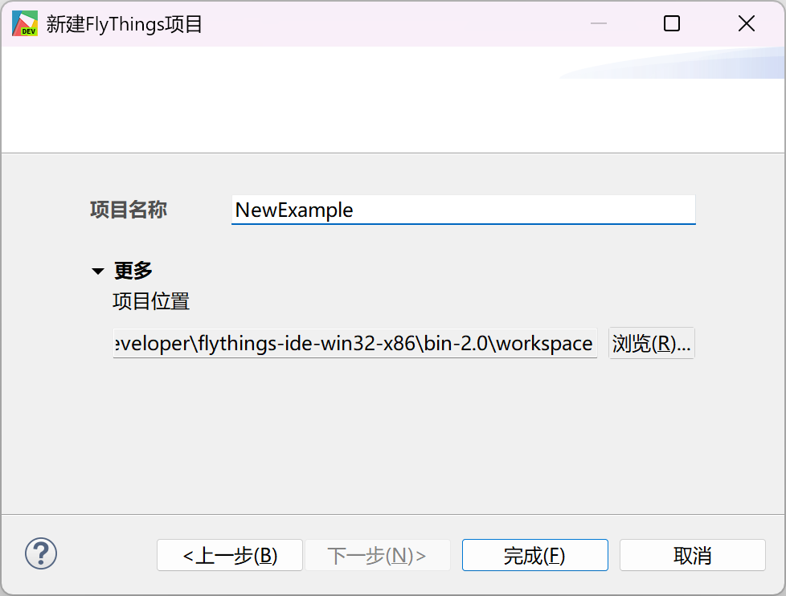

   * **项目名**：字母、数字的组合，不能出现中文及空格。
   * **位置**：项目存储路径，不推荐路径中出现中文。

   填写完成后点击 **完成** 结束创建。

---

## 新建UI文件

1. 在项目资源管理器中，展开项目，选中 `ui` 文件夹，右键依次选择 `新建` -> `FlyThings UI 文件`。

   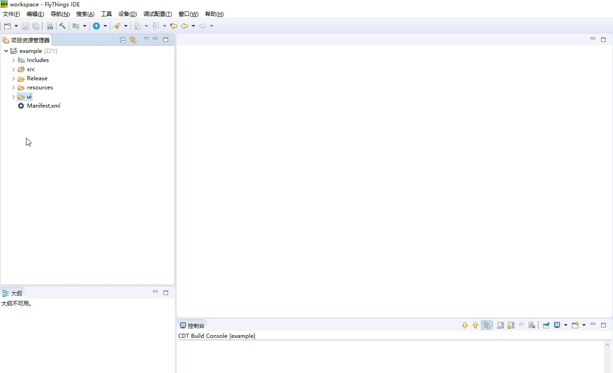

2. 在弹出的向导框中填写以下参数：
   - **文件名**：以字母、数字命名，后缀为 `ftu`。
   - **分辨率**：控制UI界面的宽高，以像素为单位。
   - **窗口类型**：一般选择 `普通`，其他类型（状态栏、导航栏、屏保）属于系统界面。

   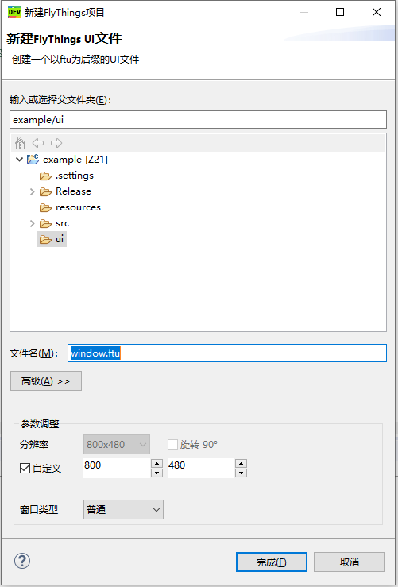

   确认参数后点击 **完成**，新建的UI文件将出现在项目的 `ui` 文件夹下。

---

## 项目结构

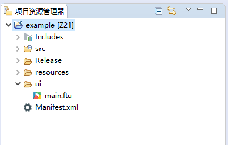

默认的项目，通常有 `src`、`resources`、`ui` 三个文件夹及一个 `Manifest.xml` 文件。

### ui 文件夹


展开 `ui` 文件夹，可以看到默认创建的 `main.ftu` 文件。`ftu` 是UI文件的后缀名，每一个 `ftu` 文件对应一个应用界面。

### resources 文件夹

该文件夹的所有内容会随程序一起打包，主要用来存放图片等资源文件。

在代码中可以获取 `resources` 目录下某个文件的绝对路径：

```c++
#include <manager/ConfigManager.h>

std::string test_txt_path = CONFIGMANAGER->getResFilePath("test.txt");
std::string back_png_path = CONFIGMANAGER->getResFilePath("sub/back.png");
```

### src 文件夹

主要存放源码文件。

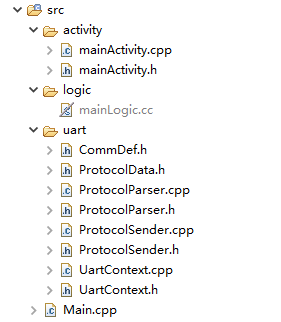

通常包含 `activity`、`logic`、`uart`、`Main.cpp`。

#### activity 文件夹
自动生成的目录，每一个UI文件编译后会生成对应的 `Activity` 类文件。

> **⚠️ 注意**：不要手动修改 `activity` 文件夹下自动生成的代码。

#### logic 文件夹
每一个UI文件编译后都会生成对应前缀名的 `Logic.cc` 文件，界面的事件与控制逻辑写在这里。

#### uart 文件夹
存放串口操作相关的代码，包括读写串口、协议解析等。

#### Main.cpp
整个应用的入口代码，包括选择开机界面及初始化。

```c++
#include "entry/EasyUIContext.h"
#include "uart/UartContext.h"
#include "manager/ConfigManager.h"
#ifdef __cplusplus
extern "C" {
#endif

void onEasyUIInit(EasyUIContext *pContext) {
    UARTCONTEXT->openUart(CONFIGMANAGER->getUartName().c_str(), CONFIGMANAGER->getUartBaudRate());
}

void onEasyUIDeinit(EasyUIContext *pContext) {
    UARTCONTEXT->closeUart();
}

const char* onStartupApp(EasyUIContext *pContext) {
    return "mainActivity";
}

#ifdef __cplusplus
}
#endif
```

### Manifest 文件
项目的清单文件，可用于更改平台、增删依赖包等。详见 [Manifest 章节](#manifest)。

---

## UI文件与生成代码

FlyThings 将UI与代码区分开来，方便管理。编译前，工具会根据UI文件生成同名前缀的 `Logic.cc` 文件（增量修改，不会完全覆盖）。工具遍历每个UI文件，为其中的控件声明对应的指针变量，定义在同名前缀的 `Activity.cpp` 中。

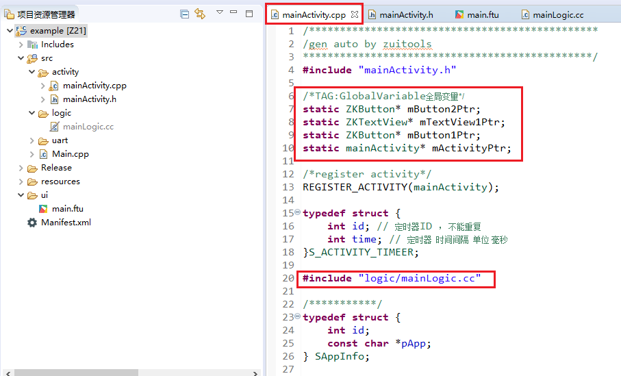

图中可以看到，所有指针为静态全局变量，并且 `mainActivity.cpp` 中包含了 `#include "logic/mainLogic.cc"` 语句，因此在 `mainLogic.cc` 中可以直接使用这些控件指针。

### Logic.cc 中自动生成的函数

| 函数 | 说明 |
|------|------|
| `REGISTER_ACTIVITY_TIMER_TAB[]` | 用于注册定时器，填写定时器 id 和时间间隔（毫秒） |
| `onUI_init()` | 界面初始化时调用，对应 `onCreate()` |
| `onUI_intent()` | 切换到该界面时触发 |
| `onUI_show()` | 界面显示时触发 |
| `onUI_hide()` | 界面隐藏时触发 |
| `onUI_quit()` | 界面退出时调用，对应析构函数 |
| `onProtocolDataUpdate()` | 串口数据回调，收到解析后的数据帧时触发 |
| `onUI_Timer(int id)` | 定时器回调，返回 `true` 继续运行，`false` 停止 |

---

## 编译项目

有三个地方可以编译。

### 从项目资源管理器编译
在项目资源管理器中，右键点击项目名，在弹出菜单中选择 `编译FlyThings` 即可。

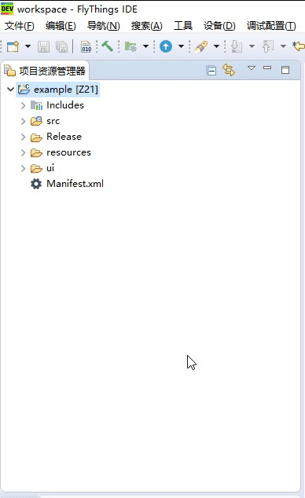

### 从工具栏编译
左键选中项目名，再点击工具栏上的  绿色三角按钮即可编译。

### 编译快捷键
快捷键 `Ctrl + Alt + Z`，推荐使用此方式。

### 清理项目
编译时会自动创建 `Release` 文件夹存放临时文件，可随意删除。也可右键项目名选择 `清空项目` 来清理缓存文件。

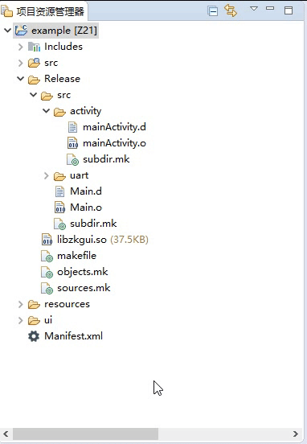

### 重新编译
先清理项目，再重新编译即可完全重建。

---

## 运行项目

项目编译后，可通过以下几种方式放到真机运行：

### 使用 Wi-Fi 连接设备快速运行
仅支持带 Wi-Fi 的机型。

1. 进入设备的 Wi-Fi 设置界面，将设备连接到与电脑相同的无线网络。
2. 连接成功后，查看设备 IP 地址。
3. 在开发工具菜单栏依次选择 **调试配置** -> **ADB配置**，ADB 连接方式选择 **WIFI**，填入设备 IP，选择下载目录后保存。
4. 选择 **下载调试** 菜单项，将项目代码同步到设备运行。

### 使用 USB 连接设备快速运行
适用于不带 Wi-Fi 的机型。**注意：带 Wi-Fi 的机型 USB 连接无效。**

1. 用 USB 线连接设备与电脑，若提示驱动问题可参考安装 ADB 驱动。
2. 在菜单栏依次选择 **调试配置** -> **ADB配置**，ADB 连接方式选择 **USB**，选择下载目录后保存。
3. 选择 **下载调试** 菜单项，将项目代码同步到设备运行。

### 借助 TF 卡启动
如果 USB 和 Wi-Fi 都不可用，可借助 TF 卡启动程序，具体步骤参考 [从TF卡启动程序](#升级与调试)。

---

## 开发工具常用技巧

### 快速跳转至关联函数
在预览图上选中一个控件，右键选择 **跳转到相关代码**，即可打开对应的 Logic.cc 文件并定位到关联函数。

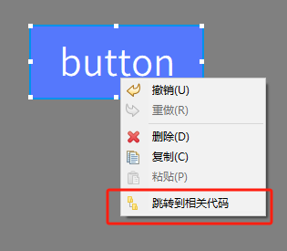

### 修改字体/字体大小
在菜单栏选择 **窗口** -> **首选项**，在弹出框中进行字体设置。

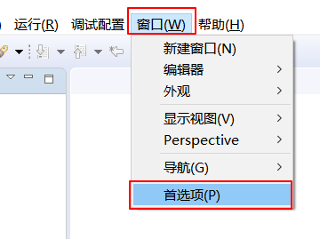
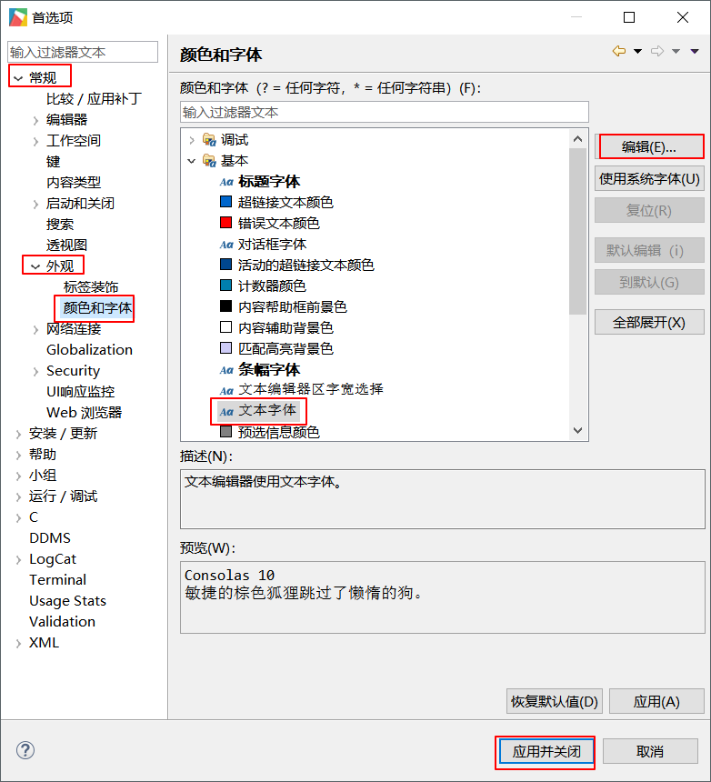

### 代码智能补全
编辑代码时输入起始部分，按 **Alt + /** 打开代码补全。

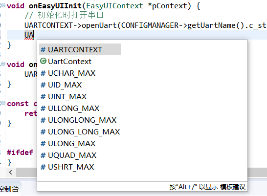

### 重建索引
如果代码补全失效或编辑器提示错误但编译正常，请尝试重建索引。

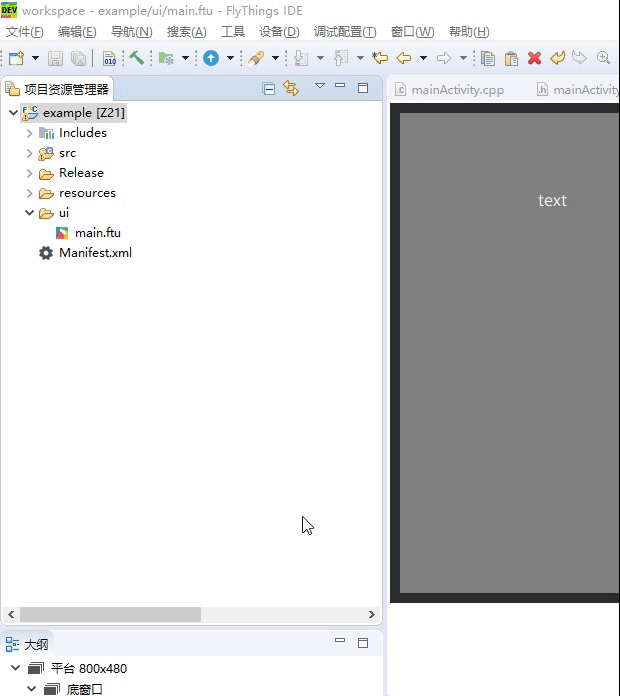

---

## 导入项目

1. 在菜单栏依次选择 **文件** -> **导入**。
2. 在弹出框中依次选择 **常规** -> **现有项目到工作空间中**，点击 **下一步**。
3. 点击 **浏览** 按钮，指定需要导入项目的文件夹，点击 **确定**。
4. 确认识别出的项目后，点击 **完成**，项目将出现在项目资源管理器中。


---

# Manifest

## Manifest 介绍

`Manifest.xml` 是重要的配置文件，通过编辑此文件可以配置项目平台、管理依赖包以及实现更多功能。

双击 `Manifest.xml` 即可编辑。

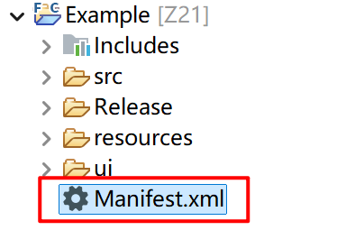

---

## 切换平台

双击 `Manifest.xml`，在项目平台下拉框中直接切换平台，更改后按 `Ctrl+S` 保存。

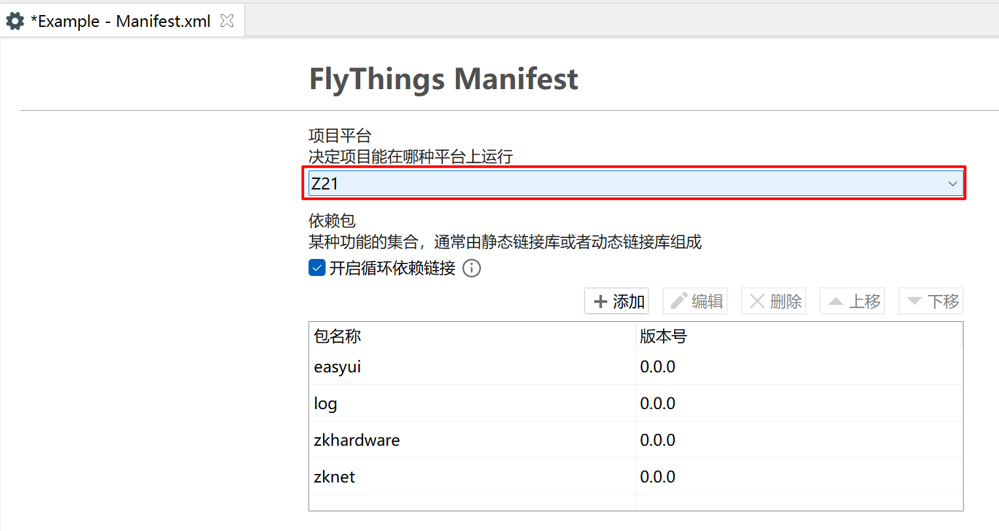

开发工具会根据当前平台生成对应的宏定义，代码中可通过宏定义判断当前平台：

```c++
#if __PLATFORM_Z6S__
// Z6S平台
#elif __PLATFORM_Z21__
// Z21平台
#elif __PLATFORM_Z20__
// Z20平台
#elif __PLATFORM_Z261__
// Z261平台
#elif __PLATFORM_T113__
// T113平台
#elif __PLATFORM_T113EMMC__
// T113EMMC平台
#elif __PLATFORM_V85X__
// V85X平台
#endif
```

当项目需要在多个平台运行时，建议根据宏进行条件编译，只需维护一份代码。

---

## 添加依赖包

双击 `Manifest.xml` 开始修改配置。

我们把代码编译为静态/动态链接库后，连同头文件一起打包并赋予版本号上传到服务器，称为 `依赖包`。可访问 <a href="https://package.flythings.cn/" target="_blank">依赖包仓库</a> 浏览已有依赖包。

点击 `添加`，在弹出框中输入包名称和版本号，点击确定后按 `Ctrl+S` 保存。

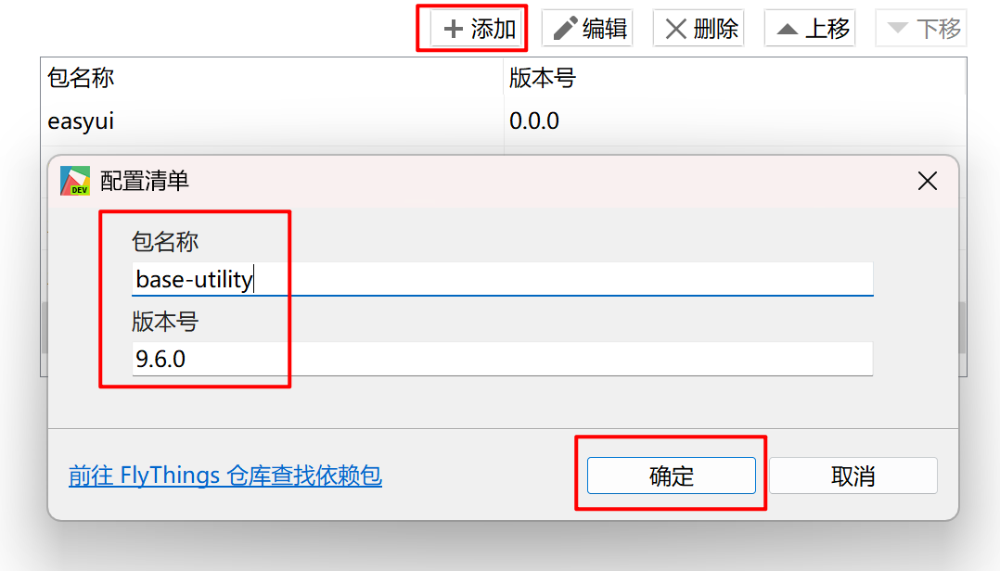

建议在依赖包仓库中点击 `复制`，再在输入框中 `Ctrl+V` 粘贴，可自动填充包名和版本号。

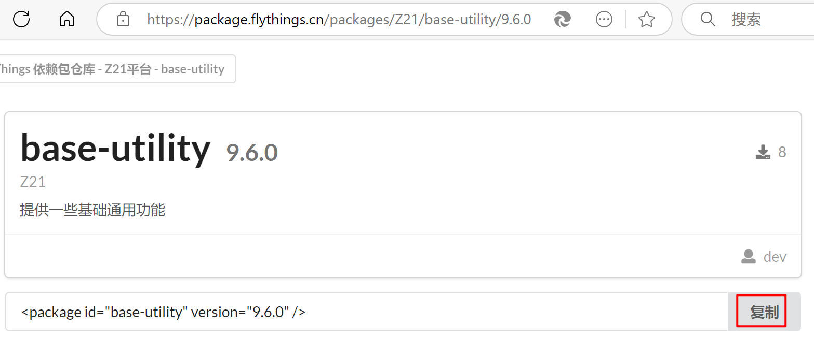

> **⚠️ 重要**：添加完成后，记得点击菜单 `更新依赖` 完成更新。

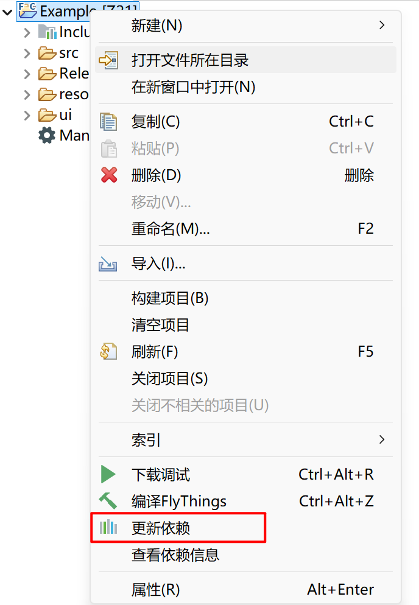

更新成功后，项目 `Include` 里会出现依赖包的头文件，即可在代码中引用：

```c++
#include <base/base.h>
```

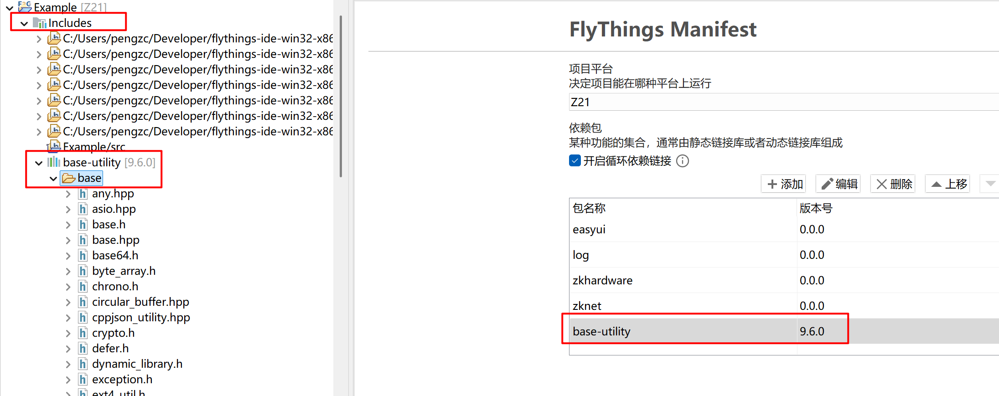

---

## 添加本地库

如果是私有的静态/动态链接库，可将库文件放到约定文件夹下，编译时将自动链接。

1. 在项目 `src` 文件夹内新建 `dependencies` 文件夹。
2. 在 `dependencies` 内新建 `include` 文件夹（编译时作为头文件搜索目录）。
3. 在 `dependencies` 内新建 `lib` 文件夹（编译时自动链接其中所有静态库及动态库）。
   - 如存在 `dependencies/lib-no-link` 文件夹，其中的动态库仅随程序打包，不参与编译。
   - 库文件名必须以 `lib` 开头，静态库后缀 `.a`，动态库后缀 `.so`，否则将被忽略。
4. 将头文件复制到 `include` 文件夹，库文件复制到 `lib` 文件夹，目录结构如下：

   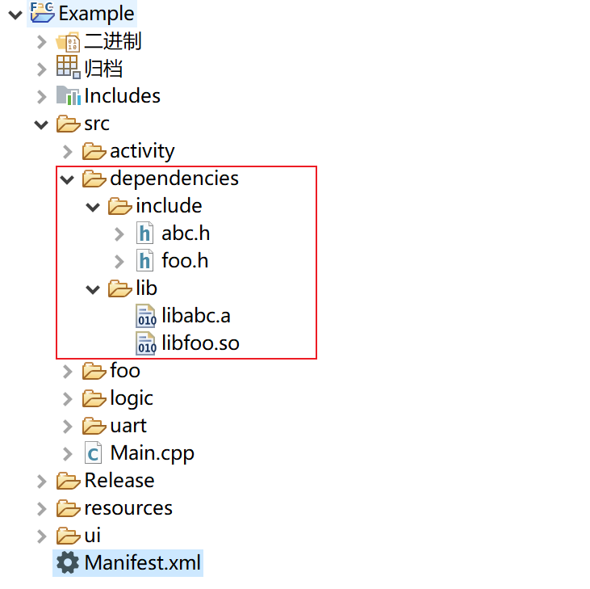

5. 右键项目名，在上下文菜单中选择 `更新依赖`，再次编译后依赖生效。
6. 在代码中引用：
   ```c++
   #include "foo.h"
   #include "abc.h"
   ```

---

## 制作静态库或动态库

双击打开 `Manifest.xml`，切换到 `源文件` 视角，按规则添加 `target` 标签即可制作静态或动态链接库。

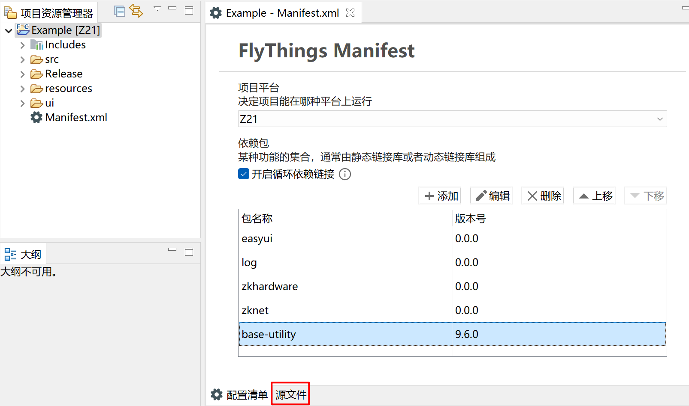

```xml
<?xml version="1.0" encoding="UTF-8"?>
<!DOCTYPE xml>
<manifest platform="Z21">
    <targets>
        <!-- 生成 libfoo1.a 静态链接库 -->
        <target id="foo1" type="staticLibrary">
            <header filter="src/foo/hello.h" />
            <source filter="src/foo/hello.cpp" />
        </target>

        <!-- 生成 libfoo2.so 动态链接库 -->
        <target id="foo2" type="sharedLibrary">
            <header filter="src/foo/hello.h" />
            <source filter="src/foo/hello.cpp" />
        </target>
    </targets>
</manifest>
```

- `id`：库名称；`type`：`staticLibrary`（静态库）或 `sharedLibrary`（动态库）
- `header`：指定随库提供的头文件，`filter` 支持通配符
- `source`：指定需要编译成库的源文件，`filter` 支持通配符

编译后，库文件将生成到 `Release` 目录下。

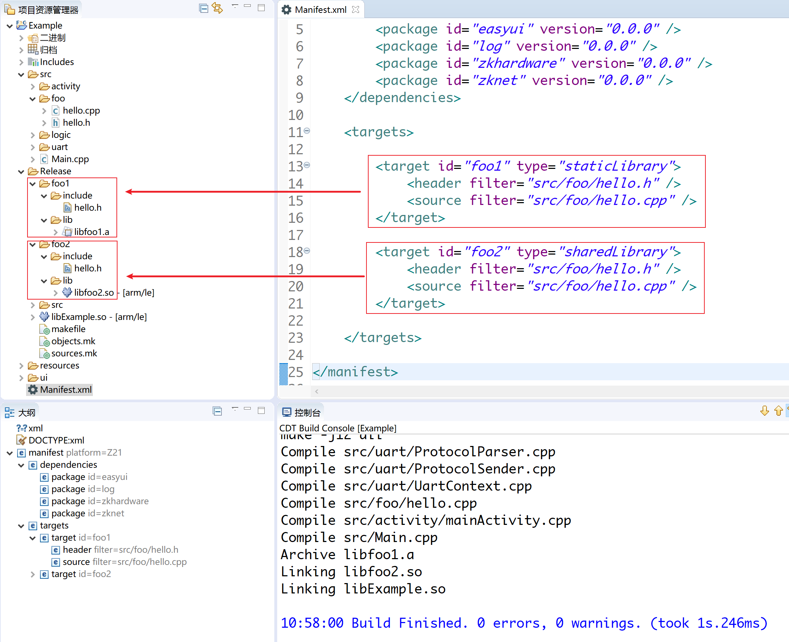

---

# 界面交互

## 启动界面

新建项目时生成的 `Main.cpp` 中，`onStartupApp()` 函数返回值决定了启动界面：

```c++
const char* onStartupApp(EasyUIContext *pContext) {
    return "mainActivity";  // 对应 main.ftu
}
```

## 打开/关闭界面

### 打开界面

```c++
EASYUICONTEXT->openActivity("subActivity");
```

如需传递参数：

```c++
Intent *pIntent = new Intent();
pIntent->putExtra("cmd", "open");
pIntent->putExtra("value", "ok");
EASYUICONTEXT->openActivity("subActivity", pIntent);
```

在目标界面的 `onUI_intent` 中接收：

```c++
static void onUI_intent(const Intent *intentPtr) {
    if (intentPtr) {
        std::string cmd = intentPtr->getExtra("cmd");   // "open"
        std::string value = intentPtr->getExtra("value"); // "ok"
    }
}
```

> new 出来的 Intent 不需要手动 delete，由框架内部自动释放。

### 关闭界面

```c++
EASYUICONTEXT->goBack();       // 返回上一级界面
EASYUICONTEXT->goHome();       // 直接回退到启动界面
EASYUICONTEXT->closeActivity("subActivity"); // 关闭指定界面（不能关闭启动界面）
```

也可以将按钮 ID 设置为 `sys_back` 或 `sys_home`，系统会自动响应对应功能。

---

## 界面活动周期

界面之间形成**栈**结构，后打开的界面在层级上层。

### 打开界面时的流程

- 若界面栈中**不存在**该界面：依次触发 `onUI_init` → `onUI_intent` → `onUI_show`
- 若界面栈中**已存在**该界面：仅将其移至顶层，不触发 `onUI_init`

### 关闭界面时的流程

- `goBack()`：弹出顶层界面，触发 `onUI_quit`，然后触发下一层的 `onUI_show`
- `goHome()`：直接回退到启动界面，弹出其他所有界面
- `closeActivity("xxx")`：移除指定界面；若移除的不是顶层界面，下一层不触发 `onUI_show`

> 如果界面打开时申请了资源，记得在 `onUI_quit` 中释放。

---

# 定时器

## 定时器

定时器适用于需要定时执行操作的场景，例如定时发送心跳包、定时查询数据刷新界面、轮询任务等。

### 注册定时器

在 `Logic.cc` 的定时器数组中添加结构体即可注册：

```c++
static S_ACTIVITY_TIMEER REGISTER_ACTIVITY_TIMER_TAB[] = {
    {0, 6000},  // 定时器id=0，时间间隔6秒
    {1, 1000},  // 定时器id=1，时间间隔1秒
};
```

结构体定义：

```c++
typedef struct {
    int id;   // 定时器ID，不能重复
    int time; // 时间间隔，单位：毫秒
} S_ACTIVITY_TIMEER;
```

### 定时器回调

定时器触发时，系统调用对应 `Logic.cc` 中的 `onUI_Timer(int id)`：

```c++
static bool onUI_Timer(int id) {
    switch (id) {
        case 0:
            // id=0 的定时器逻辑
            break;
        case 1:
            // id=1 的定时器逻辑
            break;
        default:
            break;
    }
    return true;  // 返回 true 继续运行，false 停止
}
```

> **📌 注意**
> - 每个界面的定时器独立，不同界面的定时器 id 可以相同
> - 界面未销毁时定时器持续运行，界面销毁后自动停止

---

## 手动注册/停止定时器

`REGISTER_ACTIVITY_TIMER_TAB` 方式不够灵活，Activity 类提供了以下三个方法用于动态控制定时器：

```c++
void registerUserTimer(int id, int time);   // 注册定时器
void unregisterUserTimer(int id);            // 取消定时器
void resetUserTimer(int id, int time);       // 重置定时器
```

使用示例：

```c++
static bool isRegistered = false;
#define TIMER_HANDLE 2

static bool onButtonClick_ButtonTimerOn(ZKButton *pButton) {
    if (!isRegistered) {
        mActivityPtr->registerUserTimer(TIMER_HANDLE, 500);
        isRegistered = true;
    }
    return false;
}

static bool onButtonClick_ButtonTimerOff(ZKButton *pButton) {
    if (isRegistered) {
        mActivityPtr->unregisterUserTimer(TIMER_HANDLE);
        isRegistered = false;
    }
    return false;
}
```

> **⚠️ 重要**：`registerUserTimer`、`unregisterUserTimer`、`resetUserTimer` 三个函数**不能**在 `onUI_Timer` 中调用，会造成死锁。

---

# 串口通讯

## Linux串口编程

> **本篇旨在帮助理解 FlyThings 项目串口部分代码从零到有的过程，从而更容易理解最终提供的串口代码流程。**

该产品基于 Linux 系统，可完全沿用标准 Linux 编程来操作串口，分为以下5个步骤：

### 1. 打开串口

```c++
#include <fcntl.h>

int fd = open("/dev/ttyS0", O_RDWR | O_NOCTTY);
```

`/dev/ttyS0` 类似 Windows 上的 `COM1`，打开成功返回非负的串口描述符，失败返回负数。

### 2. 配置串口

```c++
int openUart() {
    int fd = open("/dev/ttyS0", O_RDWR | O_NOCTTY);
    struct termios oldtio = { 0 };
    struct termios newtio = { 0 };
    tcgetattr(fd, &oldtio);
    newtio.c_cflag = B115200 | CS8 | CLOCAL | CREAD;
    newtio.c_iflag = 0;
    newtio.c_oflag = 0;
    newtio.c_lflag = 0;
    newtio.c_cc[VTIME] = 0;
    newtio.c_cc[VMIN] = 1;
    tcflush(fd, TCIOFLUSH);
    tcsetattr(fd, TCSANOW, &newtio);
    fcntl(fd, F_SETFL, O_NONBLOCK);
    return fd;
}
```

> **注意**：以上为默认配置（8数据位、1停止位、无校验），非特殊需求请勿修改。

### 3. 读串口

```c++
unsigned char buffer[1024] = {0};
int ret = read(fd, buffer, sizeof(buffer));
```

返回值 > 0 表示读取到数据，返回字节数；≤ 0 表示错误或暂无数据。

> **注意**：`read` 不保证一次读完所有数据，需要多次调用才能保证数据完整。

### 4. 发送串口

```c++
unsigned char buffer[4] = {0x01, 0x02, 0x03, 0x04};
int ret = write(fd, buffer, sizeof(buffer));
```

返回值等于第三个参数值表示发送成功，否则表示异常。

### 5. 关闭串口

```c++
close(fd);
```

---

## 串口简介

屏和 MCU 之间通过串口进行通信，双方约定好协议即可交互。与传统串口屏作为从机不同，FlyThings 屏具有逻辑处理能力，作为主机端。

新建工程时工具会自动生成串口通讯代码，并提供协议数据与界面交互的回调接口，开发人员只需关注数据在 UI 上的展示，通讯部分由框架自动完成。协议解析部分需根据实际通讯协议做相应修改。

---

## 通讯框架讲解

### 代码框架

软件 APP 分为两层：

**串口 HAL 层**
- `UartContext`：串口实体控制层，提供串口开关、发送、接收接口
- `ProtocolData`：定义通讯数据结构体，保存协议解析出的变量
- `ProtocolSender`：完成数据发送封装
- `ProtocolParser`：完成协议解析，将数据存入 `ProtocolData`，并管理串口数据变化的回调接口

**APP 应用接口层**
- 通过 `ProtocolParser` 注册监听获取更新的 `ProtocolData`
- 通过 `ProtocolSender` 向 MCU 发送指令

`UartContext` 为标准化实现，一般无需修改。

### 协议格式

以常见协议为例：

| 协议头（2字节） | 命令（2字节） | 数据长度（1字节） | 数据（N字节） | 校验（1字节，可选） |
|:-----------:|:---------:|:------------:|:-----------:|:---------------:|
| 0xFF55 | Cmd | len | data | checksum |

`CommDef.h` 中定义帧头和最小包长：

```c++
// 开启checksum校验：#define PRO_SUPPORT_CHECK_SUM
#define CMD_HEAD1   0xFF
#define CMD_HEAD2   0x55
#define DATA_PACKAGE_MIN_LEN  5  // 无校验：2+2+1=5；有校验：+1=6
```

#### 修改协议头

```c++
// 1. 修改帧头定义
#define CMD_HEAD1   0xFF
#define CMD_HEAD2   0x55

// 2. 帧头长度变化时同步修改判断语句
while ((mDataBufLen >= 2) && ((pData[0] != CMD_HEAD1) || (pData[1] != CMD_HEAD2)))
```

#### 修改协议长度位置

```c++
dataLen = pData[4];                        // pData[4] 为长度字节，按需修改
frameLen = dataLen + DATA_PACKAGE_MIN_LEN; // 帧长度=数据长度+头尾长度
```

---

## 串口配置

### 串口号对应关系

| 平台 | 软件串口号 | 硬件串口号 |
|:---:|:--------:|:--------:|
| Z11系列 | ttyS0 / ttyS1 | UART1 / UART2 |
| Z6系列 | ttyS0 / ttyS1 / ttyS2 | UART0 / UART1 / UART2 |
| Z20系列 | ttyS1 / ttyS2 / ttyS3 | UART1 / FUART / UART2 |
| Z21系列 | ttyS1 / ttyS2 / ttyS3 | UART1 / UART2 / UART3 |

### 串口波特率配置

新建工程时可在向导中配置波特率；也可右键工程选择 `Properties` 修改。

### 串口打开与关闭

在 `/Main.cpp` 中控制：

```c++
void onEasyUIInit(EasyUIContext *pContext) {
    UARTCONTEXT->openUart(CONFIGMANAGER->getUartName().c_str(), CONFIGMANAGER->getUartBaudRate());
}

void onEasyUIDeinit(EasyUIContext *pContext) {
    UARTCONTEXT->closeUart();
}
```

---

## 多串口配置

常规项目默认支持一个串口。如需多串口，需修改串口部分代码。

串口号及波特率在 `/uart/UartContext.cpp` 的 `init()` 中配置：

```c++
void UartContext::init() {
    uart0 = new UartContext(UART_TTYS0);
    uart0->openUart("/dev/ttyS0", B9600);

    uart1 = new UartContext(UART_TTYS1);
    uart1->openUart("/dev/ttyS1", B9600);
}
```

发送数据到指定串口：

```c++
unsigned char buf[2] = {1, 1};
sendProtocolTo(UART_TTYS1, 1, buf, 2); // 发送到 ttyS1
sendProtocolTo(UART_TTYS0, 1, buf, 2); // 发送到 ttyS0
```

如需区分数据来源，在 `SProtocolData` 中添加标识字段：

```c++
// ProtocolData.h
typedef struct {
    BYTE power;
    int uart_from; // 来自哪一个串口
} SProtocolData;
```

在 `procParse` 中赋值，在 `Logic.cc` 的 `onProtocolDataUpdate` 中读取 `data.uart_from` 判断来源。

---

# 网络控制

## Wi-Fi 设置

```c++
#include "net/NetManager.h"
```

打开系统内置 Wi-Fi 设置界面：

```c++
EASYUICONTEXT->openActivity("WifiSettingActivity");
```

获取 WifiManager：

```c++
WifiManager *pWM = NETMANAGER->getWifiManager();
// 或定义宏方便调用
#define WIFIMANAGER NETMANAGER->getWifiManager()
```

常用接口：

```c++
WIFIMANAGER->isSupported();        // 检测是否支持 Wi-Fi
WIFIMANAGER->isWifiEnable();       // 检测 Wi-Fi 是否开启
WIFIMANAGER->enableWifi(true);     // 开关 Wi-Fi
WIFIMANAGER->startScan();          // 扫描 Wi-Fi
WIFIMANAGER->connect(ssid, pw);    // 连接 Wi-Fi
WIFIMANAGER->disconnect();         // 断开连接
WIFIMANAGER->isConnected();        // 是否已连接
WIFIMANAGER->getConnectionInfo();  // 获取已连接 Wi-Fi 信息

// 注册/反注册监听
void addWifiListener(IWifiListener *pListener);
void removeWifiListener(IWifiListener *pListener);
```

---

## 热点设置

打开系统内置热点设置界面：

```c++
EASYUICONTEXT->openActivity("SoftApSettingActivity");
```

获取 SoftApManager：

```c++
#include "net/NetManager.h"
#define SOFTAPMANAGER NETMANAGER->getSoftApManager()
```

常用接口：

```c++
SOFTAPMANAGER->setEnable(true);             // 开关热点
SOFTAPMANAGER->isEnable();                  // 热点是否开启
SOFTAPMANAGER->getSoftApState();            // 获取当前热点状态
SOFTAPMANAGER->setSsidAndPwd("name", "pw"); // 修改热点名称和密码
SOFTAPMANAGER->getSsid();                   // 获取热点名称
SOFTAPMANAGER->getPwd();                    // 获取热点密码

// 热点状态枚举
// E_SOFTAP_DISABLED     关闭状态
// E_SOFTAP_ENABLING     打开中
// E_SOFTAP_ENABLED      打开成功
// E_SOFTAP_DISABLING    关闭中
// E_SOFTAP_ENABLE_ERROR 打开失败

// 注册/反注册状态监听
void addSoftApStateListener(ISoftApStateListener *pListener);
void removeSoftApStateListener(ISoftApStateListener *pListener);
```

---

# 系统操作

## 数据存储

以**键值对**方式永久存储少量数据（如账号、密码、配置等），掉电保存。

```c++
#include "storage/StoragePreferences.h"
```

存储接口：

```c++
StoragePreferences::putString("username", "zhang san");
StoragePreferences::putInt("age", 20);
StoragePreferences::putBool("power", true);
StoragePreferences::putFloat("temperature", 30.12);
```

读取接口（第二个参数为默认值）：

```c++
std::string name = StoragePreferences::getString("username", "");
int age          = StoragePreferences::getInt("age", 0);
bool power       = StoragePreferences::getBool("power", false);
float temp       = StoragePreferences::getFloat("temperature", 0);
```

删除/清空：

```c++
StoragePreferences::remove("username");
StoragePreferences::clear();
```

> **⚠️ 注意**：数据以文件形式保存在 flash 中，**请勿频繁写入**，以免损坏 flash。该分区大小通常在几百 KB 以内，可通过 `adb shell df` 查看 `data` 分区大小。

---

## 系统时间

```c++
#include "utils/TimeHelper.h"
```

获取当前时间：

```c++
struct tm *t = TimeHelper::getDateTime();
// t->tm_year + 1900 = 实际年份
// t->tm_mon + 1 = 实际月份
```

设置时间：

```c++
struct tm t;
t.tm_year = 2017 - 1900;
t.tm_mon  = 9 - 1;
t.tm_mday = 13;
t.tm_hour = 16;
t.tm_min  = 0;
t.tm_sec  = 0;
TimeHelper::setDateTime(&t);

// 或使用字符串（格式：yyyy-MM-dd HH:mm:ss）
TimeHelper::setDateTime("2017-09-13 16:00:00");
```

---

## TF卡/U盘

系统自动挂载路径：
- TF卡：`/mnt/extsd`
- U盘：`/mnt/usb1`、`/mnt/usb2`、`/mnt/usb3`

检查挂载状态：

```c++
#include <os/MountMonitor.h>

MOUNTMONITOR->isMounted("/mnt/extsd");  // TF卡是否已挂载
MOUNTMONITOR->isMounted("/mnt/usb1");   // U盘是否已挂载
```

访问文件路径 = 挂载目录 + 文件自身路径。

---

## 插拔TF卡监听

```c++
#include "os/MountMonitor.h"

class MyMountListener : public MountMonitor::IMountListener {
public:
    virtual void notify(int what, int status, const char *msg) {
        switch (status) {
        case MountMonitor::E_MOUNT_STATUS_MOUNTED:  // 插入，msg 为挂载路径
            LOGD("mount path: %s\n", msg);
            break;
        case MountMonitor::E_MOUNT_STATUS_REMOVE:   // 移除，msg 为卸载路径
            LOGD("remove path: %s\n", msg);
            break;
        }
    }
};

static MyMountListener sMyMountListener;

// 注册监听
MOUNTMONITOR->addMountListener(&sMyMountListener);

// 移除监听
MOUNTMONITOR->removeMountListener(&sMyMountListener);
```

也可使用新版接口监听指定路径（需 `base-utility` 包 9.0.0+）：

```c++
#include <base/base.h>

static base::MountNotification mn_extsd("/mnt/extsd", onMyMountEvent); // 监听TF卡
static base::MountNotification mn_usb1("/mnt/usb1", onMyMountEvent);   // 监听U盘
// 传空字符串表示监听所有挂载事件
static base::MountNotification mn_any("", onMyMountEvent);
```

> **注意**：`MountNotification` 实例需用 `static` 修饰，否则实例销毁后停止监听。

---

## GPIO操作

```c++
#include "utils/GpioHelper.h"
```

```c++
// 读取脚位状态：返回 1（高电平）、0（低电平）、-1（失败）
GpioHelper::input("B_02");

// 设置脚位输出：1 高电平，0 低电平；返回 0 成功，-1 失败
GpioHelper::output("B_02", 1);
```

各平台可用脚位（部分）：

| 平台 | 可用脚位 |
|:---:|:------|
| Z11S | `B_02`、`B_03`、`E_20` |
| SV50PB | `PIN7`~`PIN14`、`PIN23`、`PIN24`、`PIN26`、`PIN27` |

---

## SPI操作

```c++
#include "utils/SpiHelper.h"

uint8_t tx[512], rx[512];

// 参数：总线号、模式、时钟频率、位宽、低位在前
SpiHelper spi(1, SPI_MODE_0, 50*1000*1000, 8, false);

spi.write(tx, 5);                        // 单工写
spi.read(rx, 8);                         // 单工读
spi.halfduplexTransfer(tx, 5, rx, 8);    // 半双工传输
```

---

## 重启系统

```c++
#include <unistd.h>
#include <sys/reboot.h>

sync();               // 同步数据，防止丢失
reboot(RB_AUTOBOOT);  // 重启
```

---

## 内存和CPU信息

通过 ADB 终端查看：

```bash
adb shell cat /proc/meminfo   # 内存信息
adb shell cat /proc/cpuinfo   # CPU信息
adb shell busybox top         # 实时CPU使用情况
```

通过代码读取内存信息：

```c++
FILE *file = fopen("/proc/meminfo", "r");
char line[256];
unsigned long memTotal, memFree, memAvailable;

while (fgets(line, sizeof(line), file)) {
    if (strstr(line, "MemTotal:"))
        sscanf(line, "MemTotal: %lu kB", &memTotal);
    else if (strstr(line, "MemFree:"))
        sscanf(line, "MemFree: %lu kB", &memFree);
    else if (strstr(line, "MemAvailable:"))
        sscanf(line, "MemAvailable: %lu kB", &memAvailable);
}
fclose(file);
```

---

# 升级与调试

## ADB调试

### 连接方式

- **网络连接（推荐）**：设备支持 Wi-Fi 或以太网时，进入相应设置界面获取设备 IP 地址，然后在 IDE 菜单栏选择 **调试配置** -> **ADB配置**，填入 IP 并保存。
- **USB连接**：设备不支持网络时使用 USB 数据线连接，电脑识别为 Android 设备即为正常。若有驱动问题请安装 ADB 驱动。

> **注意**：如设备使用 A 口（大口）USB，默认为 U 盘模式，可通过以下代码切换为 ADB 模式（重启生效）：
> ```c++
> #include "storage/StoragePreferences.h"
> StoragePreferences::putInt("sys_usb_mode_key", 1);
> ```

### 下载调试

连接成功后，在项目资源管理器中右键项目名，选择 **下载调试**，或使用快捷键 `Ctrl+Alt+R`。工具会自动编译并将程序下载到设备中。

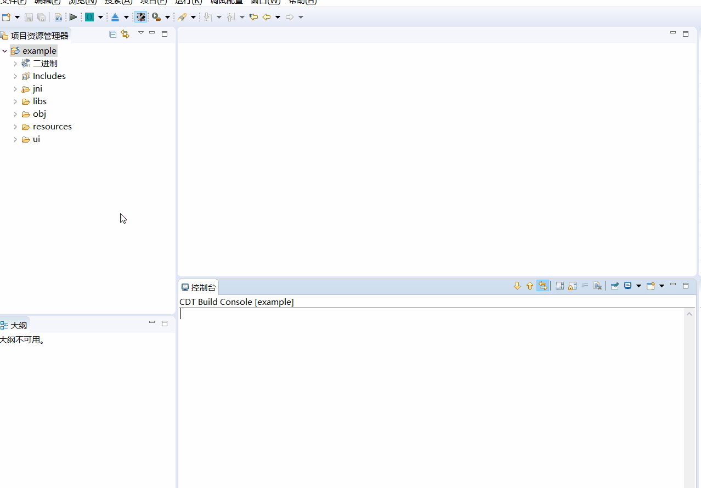

> **注意**：下载调试不会将程序固化到设备中，拔卡或断电重启后程序将恢复。如需固化，请使用制作升级镜像。

### 通过 ADB 固化应用程序

```bash
adb push ./update.img /tmp/update.img
adb shell setprop sys.zkupgrade.flag 255
adb shell setprop sys.zkupgrade.dir /tmp
adb shell setprop ctl.restart zkswe
```

### 常用 ADB 命令

在菜单栏选择 **调试配置** -> **打开系统命令行** 后可执行：

```bash
adb shell logcat -v time   # 查看带时间的日志
adb shell logcat           # 查看简单日志
adb logcat -c              # 清空日志缓存
adb shell cat /proc/meminfo
adb shell busybox top
```

---

## 查看日志

### 添加日志

```c++
#include "utils/Log.h"

LOGD("onButtonClick_Button1\n");  // 用法与 printf 相同
```

### 命令行查看日志（推荐）

1. 菜单栏选择 **调试配置** -> **打开系统命令行**
2. USB 连接：输入 `adb shell logcat -v time`
3. 网络连接：先输入 `adb connect 192.168.1.123`，再输入 `adb shell logcat -v time`
4. `Ctrl+C` 停止日志显示

### 查看标准输出日志

```bash
adb shell setprop ctl.stop zkswe   # 停止应用
zkgui                               # 启动应用并查看标准输出
```

### 查看系统日志

```bash
adb shell cat /proc/kmsg
```

---

## 从TF卡启动程序

> **注意：TF卡仅支持 FAT32 格式**

1. 菜单栏选择 **调试配置** -> **ADB配置**，点击 `设置` 按钮，设置 ADB 下载目录：`/mnt/extsd`（TF卡）或 `/mnt/usb1`（U盘）。
2. 工具栏点击调试按钮旁的下拉箭头，选择 **路径配置**，选择 TF卡盘符，点击确定。
3. 点击编译按钮，编译结果将打包输出到配置的盘符下，生成 `EasyUI.cfg`、`ui`、`lib`、`font` 等文件。
4. 将 TF 卡插入设备并重新上电，系统检测到TF卡中的文件后将启动卡里的程序。

---

## 制作升级镜像

将程序固化到设备中，断电重启后程序不会恢复。

1. 工具栏点击镜像按钮旁的下拉箭头，选择 **路径配置**，选择 `update.img` 输出目录。
2. 点击镜像编译按钮，生成 `update.img` 文件。
3. 将 `update.img` 拷贝到 FAT32 格式的TF卡根目录，插入设备重新上电。
4. 系统检测到升级文件后弹出升级界面，勾选升级项目，点击升级。
5. 升级完成后及时拔出 TF 卡，防止重复升级。

---

## 自动升级

在屏幕损坏或触摸不准时，可在 TF 卡根目录创建无后缀文件 `zkautoupgrade`，插卡后系统将自动勾选升级项并在 2 秒后开始升级。

- 在 `zkautoupgrade` 文件中填写数字可自定义延时秒数
- 在同目录放置 `zkrebootdelay` 文件并填写秒数，可控制升级完成后的延时重启时间（填 `-1` 表示不重启）

---

## 远程升级

通过 HTTP 下载 `update.img` 到设备，再触发升级检测：

```c++
#include "os/UpgradeMonitor.h"

// 检测指定目录下是否有 update.img，有则弹出升级提示框
UpgradeMonitor::getInstance()->checkUpgradeFile("/mnt/extsd/temp");
```

**避免反复升级**：将镜像下载到 `/mnt/extsd/temp/` 等子目录（而非 `/mnt/extsd/`），并同步修改检测函数的参数。

**强制自动更新**：在下载完成后创建 `zkautoupgrade` 文件即可触发自动升级。

---

## 批量升级

在同一局域网中，通过 IP 对多台设备同时升级。

1. 下载并安装批量升级软件。
2. 点击 `设置`，配置：
   - 升级文件（`update.img`）
   - 项目名（匹配设备 `ro.app.name` 属性）
   - 升级目标版本号（匹配设备 `ro.app.version` 属性）
   - IP 配置文件（每行一个 IP，支持通配符 `*`）
3. 保存设置后，工具将自动连接设备进行升级。

> **注意**：仅支持 Wi-Fi 或以太网连接的设备，不支持 USB；仅支持 Z20、Z21、Z261 平台。

---

# 附录

## 常见问题

**在UI主线程中做耗时操作导致插卡不显示升级界面**

界面刷新在UI主线程中处理，如果主线程有耗时操作或出现死循环，将影响UI刷新，导致插卡不显示升级界面。`onUI_init`、`onUI_Timer` 等回调均在UI主线程中调用，请检查这些函数中是否有耗时操作。出现此情况可重新上电，系统起来后会优先检测是否需要升级。

**无法下载调试/下载调试失败**

首先确认连接方式：带 Wi-Fi 的设备仅支持 Wi-Fi 连接，不带 Wi-Fi 的设备只能使用 USB 线连接。然后在菜单栏选择 **调试配置 -> ADB配置**，设置对应的连接方式后再次尝试下载。

**程序突然自己重启或卡住**

出现非预期情况时，首先查看日志，尝试反复重现问题。程序崩溃大部分原因是指针的错误用法（空指针、数组越界、内存释放后仍在使用等）。程序卡住则从 **线程死锁**、**代码死循环**、**长时间耗时操作** 等方向分析。


---

## 安装ADB驱动

适用于 Windows XP / Vista / 7 / 8 / 10 / 11。

1. 下载 [驱动安装程序](resources/ADBDriverInstaller.zip)
2. 通过 USB 将设备连接到计算机。
3. 打开 ADB Driver Installer，点击 **Install** 按钮。
   - 若系统提示无法验证驱动发布者，选择 **"始终安装此驱动程序软件"**。
4. 驱动将自动安装完成。

> Windows XP 用户安装驱动后建议重启。
